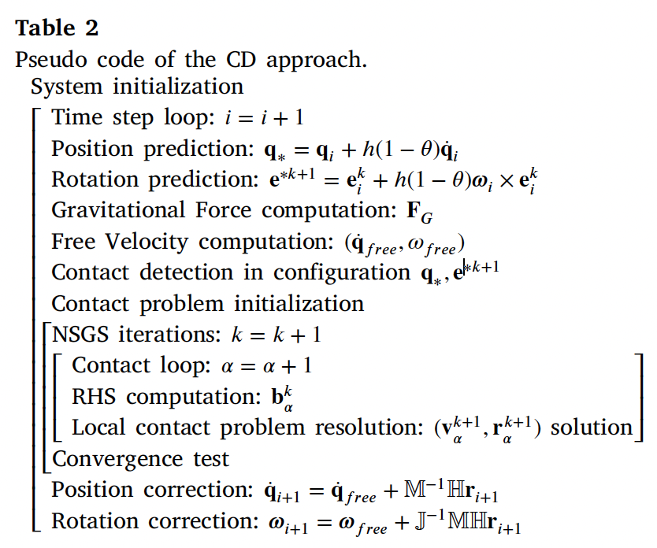
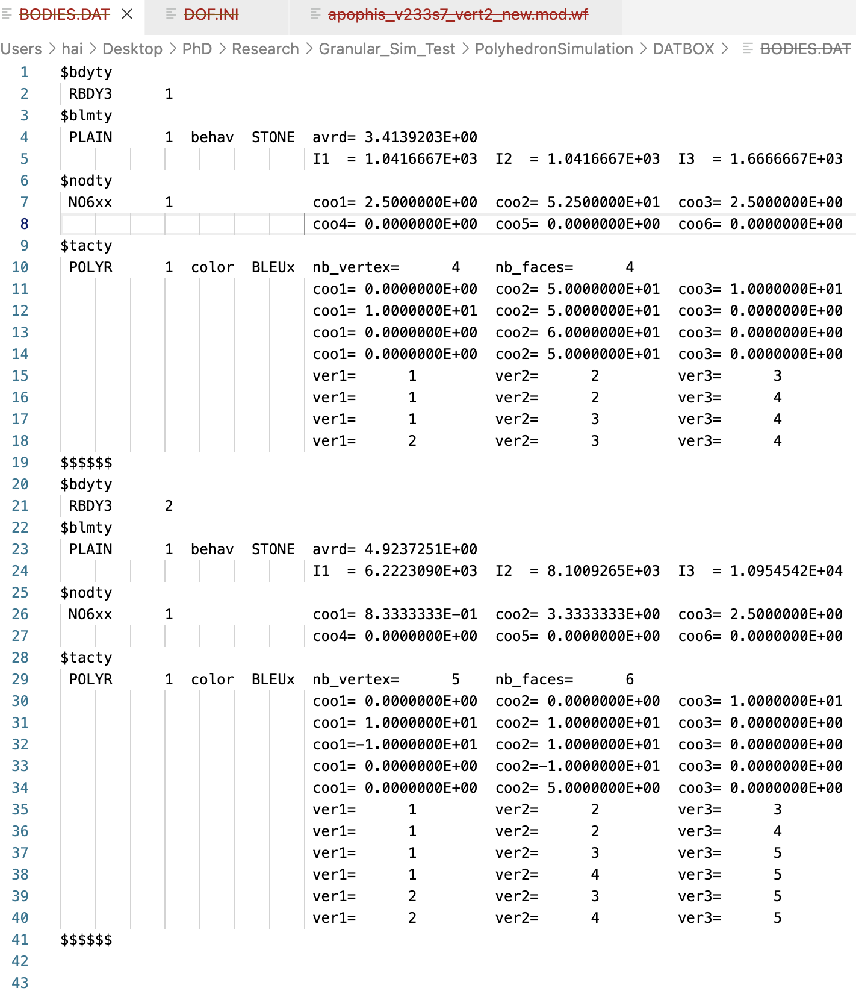
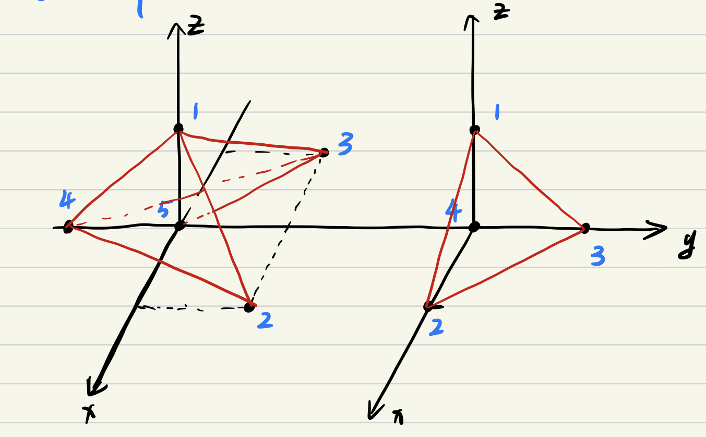
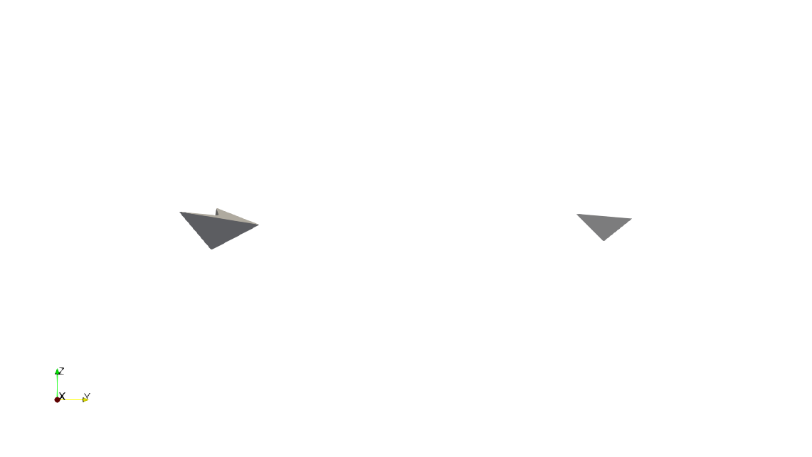
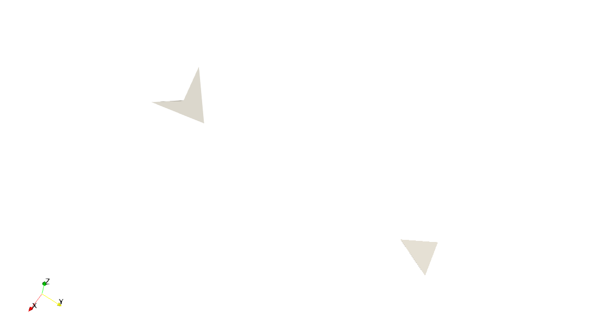

# PolyhedronSimulation
This Project uses LMGC90 to simulate Polyhendron's behavior under gravitation. The LMGC90 is one of the discrete element methods which can handle detailed contact dynamics.

There are a few papers about the code and the method (by [F. Dubois](https://scholar.google.com/citations?user=boV9fugAAAAJ&hl=en&oi=ao) and others) that you can find for yourself.  However, this is a [paper](https://www.sciencedirect.com/science/article/pii/S0019103521001238) we wrote about the implementation of self-gravity.  The code also has a [wiki](https://git-xen.lmgc.univ-montp2.fr/lmgc90/lmgc90_user/-/wikis/home) page and a very comprehensive [documentation page](http://www.lmgc.univ-montp2.fr/~mozul/LMGC90_USER/UserDoc/docs_2019/#) that you will find very useful once you start using it.

The implementation of gravitational forces is of paramount importance when simulating granular asteroids. In this work the Open Source Python library written by Mike Grudić, called [pykdgrav](https://github.com/mikegrudic/pytreegrav), is used [(Guszejnov et al., 2019a)](https://academic.oup.com/mnras/article/492/1/488/5679905). This routine is not to be confused with the PKDgrav code which has been used for many years in the Planetary and Space Science community to carry out research on asteroids, comets and planetary rings. Grudić affirms however, having taken the idea of implementing a kd-tree instead of an octree from PKDgrav.

## General Structure

- Preprocessor: Construct a numerical model
- Computation
- Visualize and analyze results

## wiki of pykdgrav
https://github.com/mikegrudic/pytreegrav/issues/1

# version20230207

bug: this code could change the raw data in gen_sample.py and Computation.py.

tries: I tried to input my raw data before 'poly1 = rigidPolyhedron()' in line 51 of gen_sample.py. I also tried to input the raw data in BODIES.DAT in DATBOX directory.

The raw data and configuration which I want to create are shown in below

<table>
    <tr>
        <td >
 
</td>
        <td >

</td>
    </tr>
</table>

But, the results got from LMGC90 code are
    
<table>
    <tr>
        <td >
 
</td>
        <td >

</td>
    </tr>
</table>

Comparing these results and raw data, we can find two considerable differences. 1. The shape of a concave polyhedron is revised. 2. The positions of two polyhedrons are changed too. 

In 'rigidContactor3D.py', some lines from 668 change the positions of vertices, but it can't explain the different values in BODIES.DAT. These lines compute the barycenter and inertial momentum matrix, and vertices positions are updated w.r.t the barycenter.

# version20230214

In this version, we can create any polyhedron we want from 'gen_sample.py', whether convex or concave. But the concave polyhedron will meet errors in 'Computation.py', such as 'Error DiscreteGeometry::build_HE_Hdl: Humm contour not closed impossible. Error: impossible to create the HE structure'

<table>
    <tr>
        <td >
 
</td>
        <td >

</td>
    </tr>
</table>

The left is the concave polyhedron, and the right one is the convex polyhedron. For the convex configuration, an animation can be generated, shown in following

https://user-images.githubusercontent.com/38872598/221667287-256bf48b-62ab-4483-93cd-5e270db99a5a.mp4

# version20230227

### Orbital Dynamics
This is a N-body problem, so the equation of motion is focused on one single body. At first, bodies that make up an asteroid are.
$$m_i \ddot{\mathbf{q}}_i=\sum_{\substack{j=1 \\ i \neq i}}^n \frac{G m_i m_j\left(\mathbf{q}_j-\mathbf{q}_i\right)}{\left\|\mathbf{q}_j-\mathbf{q}_i\right\|^3}=-\frac{\partial U}{\partial \mathbf{q}_i}$$

