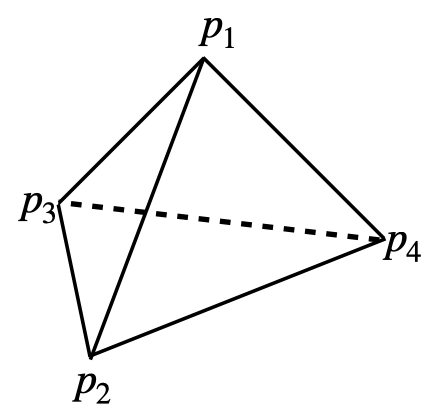

# I PolyhedronSimulation
This Project uses LMGC90 to simulate Polyhendron's behavior under gravitation. The LMGC90 is one of the discrete element methods which can handle detailed contact dynamics.

There are a few papers about the code and the method (by [F. Dubois](https://scholar.google.com/citations?user=boV9fugAAAAJ&hl=en&oi=ao) and others) that you can find for yourself.  However, this is a [paper](https://www.sciencedirect.com/science/article/pii/S0019103521001238) we wrote about the implementation of self-gravity.  The code also has a [wiki](https://git-xen.lmgc.univ-montp2.fr/lmgc90/lmgc90_user/-/wikis/home) page and a very comprehensive [documentation page](http://www.lmgc.univ-montp2.fr/~mozul/LMGC90_USER/UserDoc/docs_2019/#) that you will find very useful once you start using it.

The implementation of gravitational forces is of paramount importance when simulating granular asteroids. In this work the Open Source Python library written by Mike Grudić, called [pykdgrav](https://github.com/mikegrudic/pytreegrav), is used [(Guszejnov et al., 2019a)](https://academic.oup.com/mnras/article/492/1/488/5679905). This routine is not to be confused with the PKDgrav code which has been used for many years in the Planetary and Space Science community to carry out research on asteroids, comets and planetary rings. Grudić affirms however, having taken the idea of implementing a kd-tree instead of an octree from PKDgrav.

## I-1. General Structure

- Preprocessor: Construct a numerical model
- Computation
- Visualize and analyze results

## I-2. wiki of pykdgrav
[pykdgrav](https://github.com/mikegrudic/pytreegrav/issues/1)

## I-3. tetrahedron volume formula

$$V=\frac{1}{6}\left|\begin{array}{lll}
x_2-x_1 & y_2-y_1 & z_2-z_1 \\
x_3-x_1 & y_3-y_1 & z_3-z_1 \\
x_4-x_1 & y_4-y_1 & z_4-z_1
\end{array}\right|$$

# II N-body Dynamics 

This is an N-body problem, so the motion equation focuses on one single body. At first, bodies that make up an asteroid are

$$m_i F^{ext} = m_i \ddot{\mathbf{q}}_i=-\sum_{\substack{j=1 \\ j \neq i}}^n \frac{G m_i m_j\left(\mathbf{q}_j-\mathbf{q}_i\right)}{\left\|\mathbf{q}_j-\mathbf{q}_i\right\|^3}=-\sum_{\substack{j=1 \\ j \neq i}}^n \frac{G m_i m_j\mathbf{r}_{ji}}{r_{ji}^3}$$

Employing a normalized unit to speed up the integration

$$[L] =  (V)^{1/3},~[M] = \sum m_i,~[T] = \sqrt{[L]^3/G[M]},~ G = 1$$

in which $V$ is the volume of the combo. Rewrite the equation,

$$\mu_i F^{ext} =-\sum_{\substack{j=1 \\ j \neq i}}^n \frac{\mu_i \mu_j\mathbf{r}_{ji}}{r_{ji}^3}$$

where $\mu_i = m_i/[M]$.

# III Flyby Orbit

From the known knowledge, we have the Geocentric hyperbolic orbit elements $\sigma_G$. We need to transport it to the Apophis's center mass frame $\mathbf{r}_0$ .

$$\sigma_G \Rightarrow \mathbf{R}_G \Rightarrow \mathbf{r}_0$$

The intermediate variable $\mathbf{R}_G$ is the asteroid's vector at the Earth Center Inertial Coordinates (ECI). We have the equation 

$$\mathbf{r_0}=-\mathbf{R}_G$$

Considering the two body problems and hyperbolic orbit, we have

$$r_0 = R_G=\frac{a(e^2-1)}{1+e\cos f}$$.

Solve the two-body problem, 

$$m_i \ddot{\mathbf{q}}_{cm} = \frac{Gm_0m_A\mathbf{r}_{0}}{r_{0}^3}$$

$$m_0 \ddot{\mathbf{q}}_{0} = -\frac{Gm_0m_A\mathbf{r}_{0}}{r_{0}^3}$$

we can get the solution w.r.t $\mathbf{r}_{0}$.

$$\ddot{\mathbf{r}}_{0} = \ddot{\mathbf{q}}_{0} - \ddot{\mathbf{q}}_{cm} = -\frac{G(m_0+m_A)\mathbf{r}_{0}}{r_{0}^3}$$

Employing a normalized unit to speed up the integration

$$[L] = R_E,~[M] = m_0 + m_A,~[T] = \sqrt{[L]^3/G[M]},~ G = 1$$

So we have

$$\ddot{\mathbf{r}}_{0} = -\frac{\mathbf{r}_{0}}{r_{0}^3}$$

After integration, we will put the unit back in the main computation scheme.

Considering the higher-order terms in Earth's gravity by spherical harmonic expansion

$$\begin{aligned}
U= & \frac{G m_0}{R_E} \sum_{n=0}^{\infty} \sum_{m=0}^n\left(\frac{R_E}{r}\right)^{n+1} P_{n m}(\sin \phi) \cdot\left[\begin{array}{c}
\cos (m \lambda) \\
\sin (m \lambda)
\end{array}\right] \cdot\left[\begin{array}{c}
C_{n m} \\
S_{n m}
\end{array}\right],
\end{aligned}$$

The 0th, 1st and 2nd orders are considered at first,

$$U_0 = \frac{Gm_0}{r}, ~ U_1 = \frac{Gm_0}{r^3}\mathbf{r}\cdot\mathbf{r}_{cm}, ~ U_2 = \frac{C_{20}}{r^3}\left(\frac{3}{2} \frac{z^2}{r^2}-\frac{1}{2}\right)+\frac{3 C_{22}}{r^5}\left(x^2-y^2\right)$$

in which,

$$\vec{r}_{cm}=\left[\begin{array}{ll}
R_EC_{11} \\
R_ES_{11} \\
R_EC_{10}
\end{array}\right],~\frac{\mathbf{r}}{|r|}=\hat{\mathbf{r}} = \left[\begin{array}{l}
\cos \phi \cos \lambda \\
\cos \phi \sin \lambda \\
\sin \phi
\end{array}\right]$$

Accelerations of these two terms are

$$\frac{\partial U_0}{\partial \mathbf{r}} = -\frac{G m_0 \mathbf{r}}{r^3},~\frac{\partial U_1}{\partial \boldsymbol{r}}=\frac{G m_0}{r^3}\left[I_{[3 \times 3]}-3 \hat{r} \hat{r}\right] \cdot r_{\mathrm{CM}}$$

## III-1. Flyby Orbit Implementation

The Apophis flyby orbit is a Geocentric hyperbolic orbit, Orbital elements are given

| Geocentric hyperbolic orbit |                    |      |
| --------------------------- | ------------------ | ---- |
| Periapsis radius            | $3.72 \times 10^4$ | km   |
| Eccentricity                | $4.229$            |      |
| Inclination                 | $47.8$             | deg  |
| Argument of periapsis       | $-143.9$           | deg  |
| Longitude of asc. node      | $1.8$              | deg  |

The true anomaly can be used to set the initial state of Apophis, and here it is $f=-100 ~deg$.

Then the transformation from orbital elements to Position/Velocity can be employed here. With the initial state, an integration over **3 days** are computed based on the above equation of motion. The left one uses the normalized unit, and the right one is united $km$. 

<table>
    <tr>
        <td >
Fig.1 
</td>
        <td >
Fig.2 
</td>
    </tr>
</table>

The comparison between the 0th-order and 2nd-order gravity is determined with the normalized unit.

### 

