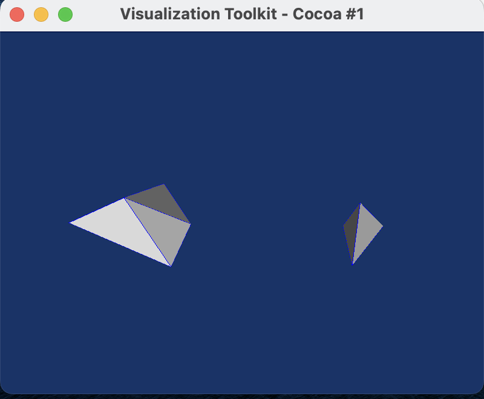

# PolyhedronSimulation
This Project uses LMGC90 to simulate Polyhendron's behaviour under gravitation. The LMGC90 is one of discrete element methonds which can handle detailed contact dynamics.

## version20230207

bug: this code could change the raw data in gen_sample.py and Computation.py.

tries: I tried to input my raw data before 'poly1 = rigidPolyhedron()' in line 51 of gen_sample.py. I also tried to input the raw data in BODIES.DAT in DATBOX directory.

The raw data and configuration which I want to create are shown in below

<table>
    <tr>
        <td >
 
</td>
        <td >

</td>
    </tr>
</table>

But, the results got from LMGC90 code are
    
<table>
    <tr>
        <td >
 
</td>
        <td >

</td>
    </tr>
</table>

Compare these results and raw data, we can find two considerable differences. 1. The shape of concave polyhedron is revised. 2. The posistions of two polyhedrons are changed too. 

In 'rigidContactor3D.py', some lines from 668 change the positions of vertices, but it cant explain the differenct values in BODIES.DAT. These lines compute the barycenter and inertial momentum matrix, and vertices positions are updated w.r.t the barycenter.

## version20230214

In this version, we can creat any ployhendrons we want from 'gen_sample.py', whatever convex or concave. But the concave polyhendron will meet errors in 'Computation.py', such as 'Error DiscreteGeometry::build_HE_Hdl: Humm contour not closed impossible .Error: impossible to create the HE structure'

<table>
    <tr>
        <td >
 
</td>
        <td >

</td>
    </tr>
</table>

The left is the concave polyhendron and the right one is the convex polyhendron. For the convex configuration, an animation can be generated shown in following [(B. Rozitis and S. F. Green 2013)](https://academic.oup.com/mnras/article/430/2/1376/2892574)

[我的博客](http://blog.csdn.net/m0_38099607 "悬停显示")  

<video width="500" height="350" controls>
    <source src="./version20230212/ResultPic/genPic2.mp4" type="video/mp4">
</video>