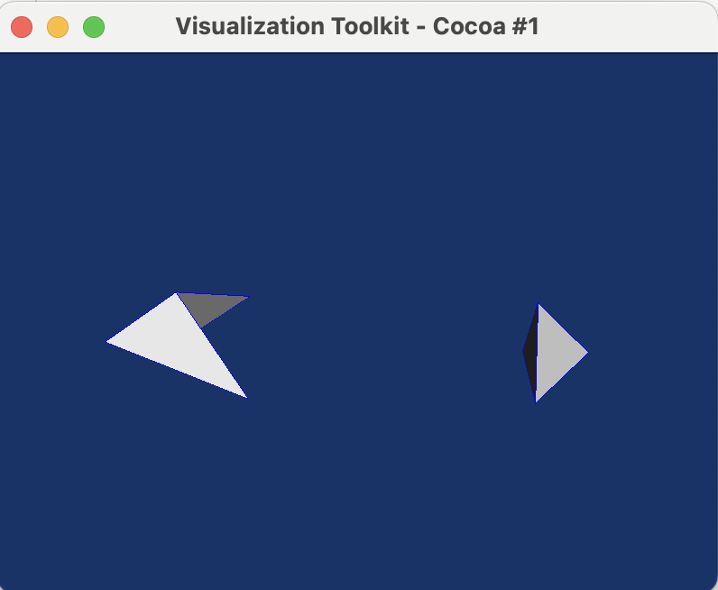
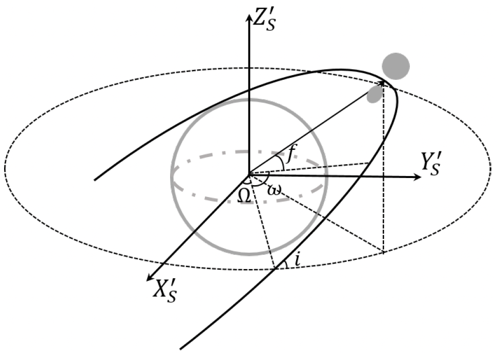

# PolyhedronSimulation
This Project uses LMGC90 to simulate Polyhendron's behavior under gravitation. The LMGC90 is one of the discrete element methods which can handle detailed contact dynamics.

There are a few papers about the code and the method (by [F. Dubois](https://scholar.google.com/citations?user=boV9fugAAAAJ&hl=en&oi=ao) and others) that you can find for yourself.  However, this is a [paper](https://www.sciencedirect.com/science/article/pii/S0019103521001238) we wrote about the implementation of self-gravity.  The code also has a [wiki](https://git-xen.lmgc.univ-montp2.fr/lmgc90/lmgc90_user/-/wikis/home) page and a very comprehensive [documentation page](http://www.lmgc.univ-montp2.fr/~mozul/LMGC90_USER/UserDoc/docs_2019/#) that you will find very useful once you start using it.

The implementation of gravitational forces is of paramount importance when simulating granular asteroids. In this work the Open Source Python library written by Mike Grudić, called [pykdgrav](https://github.com/mikegrudic/pytreegrav), is used [(Guszejnov et al., 2019a)](https://academic.oup.com/mnras/article/492/1/488/5679905). This routine is not to be confused with the PKDgrav code which has been used for many years in the Planetary and Space Science community to carry out research on asteroids, comets and planetary rings. Grudić affirms however, having taken the idea of implementing a kd-tree instead of an octree from PKDgrav.

## 1. General Structure

- Preprocessor: Construct a numerical model
- Computation
- Visualize and analyze results

## 2. wiki of pykdgrav
[pykdgrav](https://github.com/mikegrudic/pytreegrav/issues/1)

# version20230207

bug: this code could change the raw data in gen_sample.py and Computation.py.

tries: I tried to input my raw data before 'poly1 = rigidPolyhedron()' in line 51 of gen_sample.py. I also tried to input the raw data in BODIES.DAT in DATBOX directory.

The raw data and configuration which I want to create are shown in below

<table>
    <tr>
        <td >
 
</td>
        <td >

</td>
    </tr>
</table>

But, the results got from LMGC90 code are
<table>
    <tr>
        <td >
 
</td>
        <td >

</td>
    </tr>
</table>

Comparing these results and raw data, we can find two considerable differences. 1. The shape of a concave polyhedron is revised. 2. The positions of two polyhedrons are changed too. 

In 'rigidContactor3D.py', some lines from 668 change the positions of vertices, but it can't explain the different values in BODIES.DAT. These lines compute the barycenter and inertial momentum matrix, and vertices positions are updated w.r.t the barycenter.

# version20230214

In this version, we can create any polyhedron we want from 'gen_sample.py', whether convex or concave. But the concave polyhedron will meet errors in 'Computation.py', such as 'Error DiscreteGeometry::build_HE_Hdl: Humm contour not closed impossible. Error: impossible to create the HE structure'

<table>
    <tr>
        <td >
 
</td>
        <td >

</td>
    </tr>
</table>

The left is the concave polyhedron, and the right one is the convex polyhedron. For the convex configuration, an animation can be generated, shown in following

https://user-images.githubusercontent.com/38872598/221667287-256bf48b-62ab-4483-93cd-5e270db99a5a.mp4

# version20230227

### 1. Orbital Dynamics

This is an N-body problem, so the equation of motion is focused on one single body. At first, bodies that make up an asteroid are

$$m_i F^{ext} = m_i \ddot{\mathbf{q}}_i=-\sum_{\substack{j=1 \\ j \neq i}}^n \frac{G m_i m_j\left(\mathbf{q}_j-\mathbf{q}_i\right)}{\left\|\mathbf{q}_j-\mathbf{q}_i\right\|^3}=-\sum_{\substack{j=1 \\ j \neq i}}^n \frac{G m_i m_j\mathbf{r}_{ji}}{r_{ji}^3}$$

Then we added the planet perturbation

$$m_i F^{ext} + m_0 F^0 = m_i \ddot{\mathbf{q}}_i + m_0 \ddot{\mathbf{q}}_0=-\sum_{\substack{j=1 \\ j \neq i}}^n \frac{G m_i m_j\mathbf{r}_{ji}}{r_{ji}^3} - \frac{Gm_0m_i\mathbf{r}_{0i}}{r_{0i}^3}$$

in which $\mathbf{R}$ is the distance between body $i$ and planet.
$$U_0= \frac{G M_E}{R_E} \sum_{n=0}^{\infty} \sum_{m=0}^n\left(\frac{R_E}{r}\right)^{n+1} P_{n m}(\sin \phi) \cdot [\cos (m \lambda)C_{n m} + \sin (m \lambda) S_{n m}]$$

where $G$ is the gravitational constant, $M_E$ and $R_E$ are the reference mass and reference radius, $P_{n ! n}$ is the associated Legendre function of degree $n$ and order $m, \phi$ and $\lambda$ are the latitude and longitude of the spherical body in the body frame. The first-degree potential is expressed as
$$U^1=\frac{G M_E}{r^3} \boldsymbol{r} \cdot \boldsymbol{r}_{\mathrm{CM}}$$

in which
$$\boldsymbol{r}_{CM} = [R_EC_{11},R_ES_{11},R_EC_{10}]^T$$

So the Planet's perturbation force is
$$\frac{\partial U^1}{\partial \boldsymbol{r}}=\frac{G M_E}{r^3}\left[1_{[3 \times 3]}-3 \hat{r} \hat{r}\right] \cdot \boldsymbol{r}_{\mathrm{CM}}$$

From the center of mass of the Asteroid, we have the vector equation

$$\mathbf{r} = \mathbf{r}_{C} + \mathbf{q}_{Ci} = \mathbf{r}_C + \mathbf{q}_i - \mathbf{q}_{CM}$$

where 

$$\mathbf{q}_{CM} = \sum_{i=1}^n m_i \mathbf{q}_{i} / \sum_{i=1}^n m_i= \sum_{i=1}^n m_i \mathbf{q}_{i} / M_A$$. 

Using the Apophis orbital elements, we can model its flyby orbit $\mathbf{r}_{C}$ as a parabolic orbit,

$$\ddot{\mathbf{r}}_{C} = -M_A\frac{\partial U^1}{\partial \mathbf{r}_C}$$

### 2. Orbital Dynamics v2.0

This is an N-body problem, so the equation of motion is focused on one single body. At first, bodies that make up an asteroid are

$$m_i F^{ext} = m_i \ddot{\mathbf{q}}_i=-\sum_{\substack{j=1 \\ j \neq i}}^n \frac{G m_i m_j\left(\mathbf{q}_j-\mathbf{q}_i\right)}{\left\|\mathbf{q}_j-\mathbf{q}_i\right\|^3}=-\sum_{\substack{j=1 \\ j \neq i}}^n \frac{G m_i m_j\mathbf{r}_{ji}}{r_{ji}^3}$$

Then we added the planet perturbation

$$m_i F^{ext} + m_0 F^0 = m_i \ddot{\mathbf{q}}_i=-\sum_{\substack{j=1 \\ j \neq i}}^n \frac{G m_i m_j\mathbf{r}_{ji}}{r_{ji}^3} - \frac{Gm_0m_i\mathbf{r}_{0i}}{r_{0i}^3}$$

Transport the frame center to the asteroid's center mass

$$\mathbf{q}_i = \mathbf{q}_{cm} + \mathbf{r}_i, ~~~ \mathbf{q}_{cm} = \frac{\sum_{i=1}^{n}m_i\mathbf{q}_i}{\sum_{i=1}^n m_i} = \frac{\sum_{i=1}^{n}m_i\mathbf{q}_i}{m_A}$$

where $\mathbf{r_0}$ is the flyby orbit at the Apophis's center mass frame. Then the $i-th$ body's acceleration can be expressed as

$$m_i \ddot{\mathbf{r}}_i=m_i \ddot{\mathbf{q}}_i - m_i \ddot{\mathbf{q}}_{cm} = -\sum_{\substack{j=1 \\ j \neq i}}^n \frac{G m_i m_j\mathbf{r}_{ji}}{r_{ji}^3} - \frac{Gm_0m_i\mathbf{r}_{0i}}{r_{0i}^3} - m_i \ddot{\mathbf{q}}_{cm}$$

in which

$$m_i \ddot{\mathbf{q}}_{cm} = \frac{Gm_0m_A\mathbf{r}_{0}}{r_{0}^3}$$

$$m_0 \ddot{\mathbf{q}}_{0} = -\frac{Gm_0m_A\mathbf{r}_{0}}{r_{0}^3}$$

The mass $m_A$ is the asteroid mass.

### 3. Flyby Orbit

From the known knowledge, we have the Geocentric hyperbolic orbit elements $\sigma_G$. We need to transport it to the Apophis's center mass frame $\mathbf{r}_0$ .

$$\sigma_G \Rightarrow \mathbf{R}_G \Rightarrow \mathbf{r}_0$$

The intermediate variable $\mathbf{R}_G$ is the asteroid's vector at the Earth Center Inertial Coordinates (ECI). We have the equation 

$$\mathbf{r_0}=-\mathbf{R}_G$$

Considering the two body problems and hyperbolic orbit, we have

$$r_0 = R_G=\frac{a(e^2-1)}{1+e\cos f}$$.

Solve the two-body problem, 

$$m_i \ddot{\mathbf{q}}_{cm} = \frac{Gm_0m_A\mathbf{r}_{0}}{r_{0}^3}$$

$$m_0 \ddot{\mathbf{q}}_{0} = -\frac{Gm_0m_A\mathbf{r}_{0}}{r_{0}^3}$$

we can get the solution w.r.t $\mathbf{r}_{0}$.

$$\ddot{\mathbf{r}}_{0} = \ddot{\mathbf{q}}_{0} - \ddot{\mathbf{q}}_{cm} = -\frac{G(m_0+m_A)\mathbf{r}_{0}}{r_{0}^3}$$

Employing a normalized unit to speed up the integration

$$[L] = R_E,~[M] = m_0 + m_A,~[T] = \sqrt{[L]^3/G[M]},~ G = 1$$

So we have

$$\ddot{\mathbf{r}}_{0} = -\frac{\mathbf{r}_{0}}{r_{0}^3}$$

After integration, we will put the unit back in the main computation scheme.

Considering the higher-order terms in Earth's gravity by spherical harmonic expansion

$$\begin{aligned}
U= & \frac{G m_0}{R_E} \sum_{n=0}^{\infty} \sum_{m=0}^n\left(\frac{R_E}{r}\right)^{n+1} P_{n m}(\sin \phi) \cdot\left[\begin{array}{c}
\cos (m \lambda) \\
\sin (m \lambda)
\end{array}\right] \cdot\left[\begin{array}{c}
C_{n m} \\
S_{n m}
\end{array}\right],
\end{aligned}$$

The 0th, 1st and 2nd orders are considered at first,

$$U_0 = \frac{Gm_0}{r}, ~ U_1 = \frac{Gm_0}{r^3}\mathbf{r}\cdot\mathbf{r}_{cm}, ~ U_2 = \frac{C_{20}}{r^3}\left(\frac{3}{2} \frac{z^2}{r^2}-\frac{1}{2}\right)+\frac{3 C_{22}}{r^5}\left(x^2-y^2\right)$$

in which,

$$\vec{r}_{cm}=\left[\begin{array}{ll}
R_EC_{11} \\
R_ES_{11} \\
R_EC_{10}
\end{array}\right],~\frac{\mathbf{r}}{|r|}=\hat{\mathbf{r}} = \left[\begin{array}{l}
\cos \phi \cos \lambda \\
\cos \phi \sin \lambda \\
\sin \phi
\end{array}\right]$$

Accelerations of these two terms are

$$\frac{\partial U_0}{\partial \mathbf{r}} = -\frac{G m_0 \mathbf{r}}{r^3},~\frac{\partial U_1}{\partial \boldsymbol{r}}=\frac{G m_0}{r^3}\left[I_{[3 \times 3]}-3 \hat{r} \hat{r}\right] \cdot r_{\mathrm{CM}}$$

#### 3.1. Flyby Orbit Implementation

The Apophis flyby orbit is a Geocentric hyperbolic orbit, Orbital elements are given

| Geocentric hyperbolic orbit | | |
| --- | --- | --- |
| Periapsis radius | $3.72 \times 10^4$ | km |
| Eccentricity | $4.229$ | |
| Inclination | $47.8$ | deg |
| Argument of periapsis | $-143.9$ | deg |
| Longitude of asc. node | $1.8$ | deg |

The true anomaly can be used to set the initial state of Apophis, and here it is $f=-100 ~deg$.

Then the transformation from orbital elements to Position/Velocity can be employed here. With the initial state, an integration over **3 days** are computed based on the above equation of motion. The left one uses the normalized unit, and the right one is united $km$.

<table>
    <tr>
        <td >
Fig.1 
</td>
        <td >
Fig.2 
</td>
    </tr>

The comparison between the 0th-order and 2nd-order gravity is determined with the normalized unit.

### 4. Shape Model

#### 4.1. Shape Model regular 1

This Shape model is made by two regular polygons generated from spheres with radii 'R' and 'r'. The two radii of the sphere can be solved from the known parameter 'volume' and 'largest extent.' For Apophis, the 'volume = 1.986E7 m^3', the 'largest extent = 410 m'. The 'largest extent' also can be substituted by the 'mean radius = 168 m'.

https://user-images.githubusercontent.com/38872598/225046066-256d5543-6817-4fb9-bac9-dd5a495a2acd.mp4

