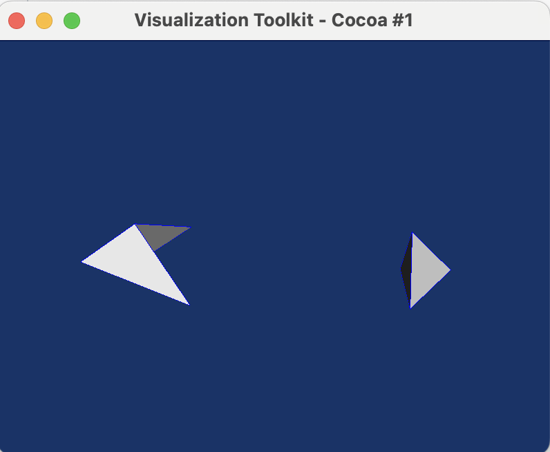
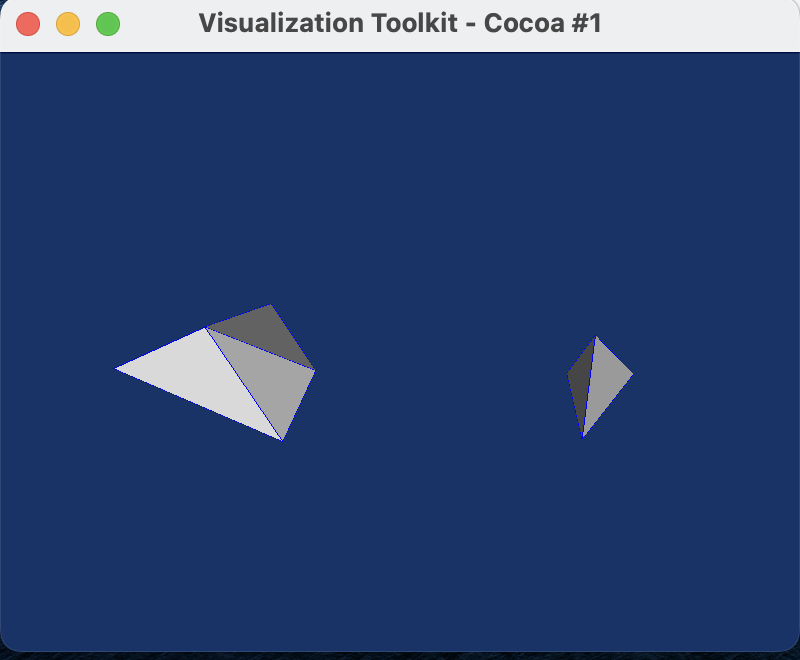
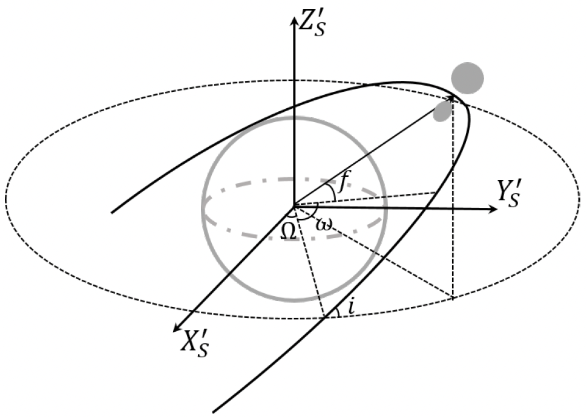

# Report 20230301

- [x] Debug the shape generation
- [x] Flyby physical model
- [ ] Debug flyby code
- [ ] Implement the Shape Segmentation Algorithm 

- The first-order acceleration in Conor2023 Eq.3 and Takahashi2013 Eq.16 is different. Is there any difference in their model? Where is Conor's equation from? 

$$
\boldsymbol{a}_{\text {tide }}=-\frac{\mu_e}{R^3}[\boldsymbol{U}-3\hat{\boldsymbol{R}} \hat{\boldsymbol{R}}] \cdot \boldsymbol{r}\\
\frac{\partial U_1}{\partial r}=\frac{G M^*}{r^3}\left[1_{[3 \times 3]}-3 \hat{r} \hat{r}\right] \cdot r_{\mathrm{CM}}
$$

- How to track the polyhedron combo's attitude?
- When constructing a polyhedron combination, is it necessary to ensure the mass and volume parameters are consistent with Apophis?

# version20230214

In this version, we can create any polyhedron we want from 'gen_sample.py', whether convex or concave. But the concave polyhedron will meet errors in 'Computation.py', such as 'Error DiscreteGeometry::build_HE_Hdl: Humm contour not closed impossible. Error: impossible to create the HE structure'

<table>
    <tr>
        <td >
 
</td>
        <td >

</td>
    </tr>
</table>

The left is the concave polyhedron, and the right one is the convex polyhedron. For the convex configuration, an animation can be generated, shown in following

https://user-images.githubusercontent.com/38872598/221667287-256bf48b-62ab-4483-93cd-5e270db99a5a.mp4

# version20230227

### Orbital Dynamics

This is an N-body problem, so the equation of motion is focused on one single body. At first, bodies that make up an asteroid are
$$
m_i F^{ext} = m_i \ddot{\mathbf{q}}_i=\sum_{\substack{j=1 \\ i \neq i}}^n \frac{G m_i m_j\left(\mathbf{q}_j-\mathbf{q}_i\right)}{\left\|\mathbf{q}_j-\mathbf{q}_i\right\|^3}
$$
Then we added the planet perturbation
$$
m_i F^{ext} + m_0 F^0 = m_i \ddot{\mathbf{q}}_i + m_0 \ddot{\mathbf{q}}_0=\sum_{\substack{j=1 \\ i \neq i}}^n \frac{G m_i m_j\left(\mathbf{q}_j-\mathbf{q}_i\right)}{\left\|\mathbf{q}_j-\mathbf{q}_i\right\|^3} - m_i \frac{\partial U_0}{\partial \mathbf{r}}
$$
in which $\mathbf{R}$ is the distance between body $i$ and planet.
$$
U_0= \frac{G M_E}{R_E} \sum_{n=0}^{\infty} \sum_{m=0}^n\left(\frac{R_E}{r}\right)^{n+1} P_{n m}(\sin \phi) \cdot [\cos (m \lambda)C_{n m} + \sin (m \lambda) S_{n m}] \sim \frac{GM}{r}
$$
where $G$ is the gravitational constant, $M_E$ and $R_E$ are the reference mass and reference radius, $P_{n ! n}$ is the associated Legendre function of degree $n$ and order $m, \phi$ and $\lambda$ are the latitude and longitude of the spherical body in the body frame. The first-degree potential is expressed as
$$
U^1=\frac{G M_E}{r^3} \boldsymbol{r} \cdot \boldsymbol{r}_{\mathrm{CM}}
$$
in which
$$
\boldsymbol{r}_{CM} = [R_EC_{11},R_ES_{11},R_EC_{10}]^T
$$
So the Planet's perturbation force is
$$
\frac{\partial U^1}{\partial \boldsymbol{r}}=\frac{G M_E}{r^3}\left[1_{[3 \times 3]}-3 \hat{r} \hat{r}\right] \cdot \boldsymbol{r}_{\mathrm{CM}}
$$
From the center of mass of the Asteroid, we have the vector equation
$$
\mathbf{r} = \mathbf{r}_{C} + \mathbf{q}_{Ci} = \mathbf{r}_C + \mathbf{q}_i - \mathbf{q}_{CM}
$$
where 
$$
\mathbf{q}_{CM} = \sum_{i=1}^n m_i \mathbf{q}_{i} / \sum_{i=1}^n m_i= \sum_{i=1}^n m_i \mathbf{q}_{i} / M_A
$$
Using the Apophis orbital elements, we can model its flyby orbit $\mathbf{r}_{C}$ as a parabolic orbit,
$$
\ddot{\mathbf{r}}_{C} = -M_A\frac{\partial (U^0+U^1)}{\partial \mathbf{r}_C}\\
\mathbf{r}_C = \frac{p}{a\sqrt{1-e^2}}
$$

### Rotational Dynamics