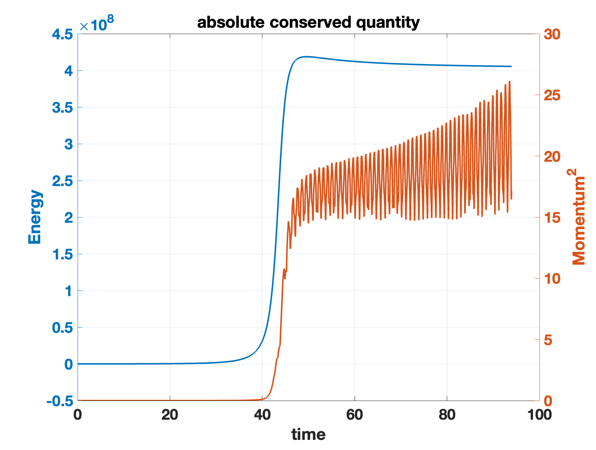

## Version20230328

Results

- Given fraction only, this combo with the same volume as Apophis will break during the flyby.

Problem

- The dynamic moment of inertia $I_d = H^2/2T$ is always smaller than the median total inertia $I_i$.
- Is there some way to define the long axis for any polyhedron? This will be used to convert angular velocity to the LAM/SAM rotation.

### 1. Shape Model

#### 1.1. UnitPoly

Two octahedrons construct this polyhedron combo. The most important feature of this shape model is normalization. The volume of this model can be normalized to 1 and costumed to any value. In this simulation, the volume is set as the Apophis volume $1.986 \times 10^7 ~m^3$ and density is $\rho = 2000 ~kg/m^3$.

<table>
    <tr>
        <td >
Fig.1 
</td>
        <td >
Fig.2 
</td>
    </tr>
</table>

The fraction in the contact law is set as 1, and normal restitution is 1. The animation is shown in the following link.

https://user-images.githubusercontent.com/38872598/228975237-3d989f56-5bfe-4986-ba3a-aa6488f74c68.mp4

#### 1.2. Conserved Quantities

$$\begin{aligned}
&T=\frac{1}{2 M} \sum_{i=1}^{N-1} \sum_{j=i+1}^N m_i m_j\left(\boldsymbol{v}_{i j} \cdot \boldsymbol{v}_{i j}\right)+\frac{1}{2} \sum_{i=1}^N I_i\left|\boldsymbol{\omega}_i\right|^2 \\
&U=-\mathcal{G} \sum_{i=1}^{N-1} \sum_{j=i+1}^N \frac{m_i m_j}{\left|\boldsymbol{r}_{i j}\right|} \\
&\boldsymbol{H}=\frac{1}{M} \sum_{i=1}^{N-1} \sum_{j=i+1}^N m_i m_j\left(\boldsymbol{r}_{i j} \times \boldsymbol{v}_{i j}\right)+\sum_{i=1}^N I_i \boldsymbol{\omega}_i
\end{aligned}$$

From these equations, we can compute the energy and angular momentum square,

$$E = T+U, H = \mathbf{H}\cdot \mathbf{H}$$

Without Earth perturbation, these two bodies have no relative motions, so fraction doesn't work in energy/momentum dissipation. We can also consider the states in terms of their effective spin rate $\omega_e = 2T/H$ and dynamic moment of inertia $I_d = H^2/2T$ where H and T are the rotational angular momentum magnitude and kinetic energy.

<table>
    <tr>
        <td >
Fig.1 
</td>
        <td >
Fig.2 
</td>
    </tr>
</table>

Here the integration arc is $dt = 1E-4$ and time span is from 0 to $1E4$. Note that the integration is without unit. 

#### 1.3. Scaled dynamic moment of inertia

Then, I tried to compute the scaled dynamic moment of inertia $\tilde{I}_d$. For short axis mode (SAM) rotation, we have $I_i < I_d < I_s$ and $\tilde{I}_d = (I_d - I_i)/(I_s - I_i)$. For the long axis mode (LAM) rotation, we have $I_l < I_d < I_i$ and $\tilde{I}_d = (I_d - I_i)/(I_i - I_l)$.

So $-1 < \tilde{I}_d < 1$ with the extremal values indicating uniform long/short axis rotation respectively and 0 indicating intermediate axis rotation or motion along the separatrix.

Here, $I_l,I_i,I_s$ respectively mean the maximum inertia, median inertia, and minimum inertia.

$$I_l = max(diag(I_{total})), ~I_i = median(diag(I_{total})),~I_s = min(diag(I_{total}))$$

The total inertia can be computed from every body's inertia addition $I_{total} = \sum I_i$.

**But, the wired thing is the $I_d$ always smaller than $I_i$. **

### 2. Results

**Given fraction only, this combo with the same volume as Apophis will break during the flyby.** Animation is shown in the following link.

https://user-images.githubusercontent.com/38872598/228975271-22edc30c-2647-4148-a3fc-d7fbaddc1e5e.mp4

<table>
    <tr>
        <td >
Fig.1 
</td>
        <td >
Fig.2 
</td>
    </tr>
</table>

<table>
    <tr>
        <td >
Fig.3 
</td>
        <td >
Fig.4 
</td>
    </tr>
</table>

